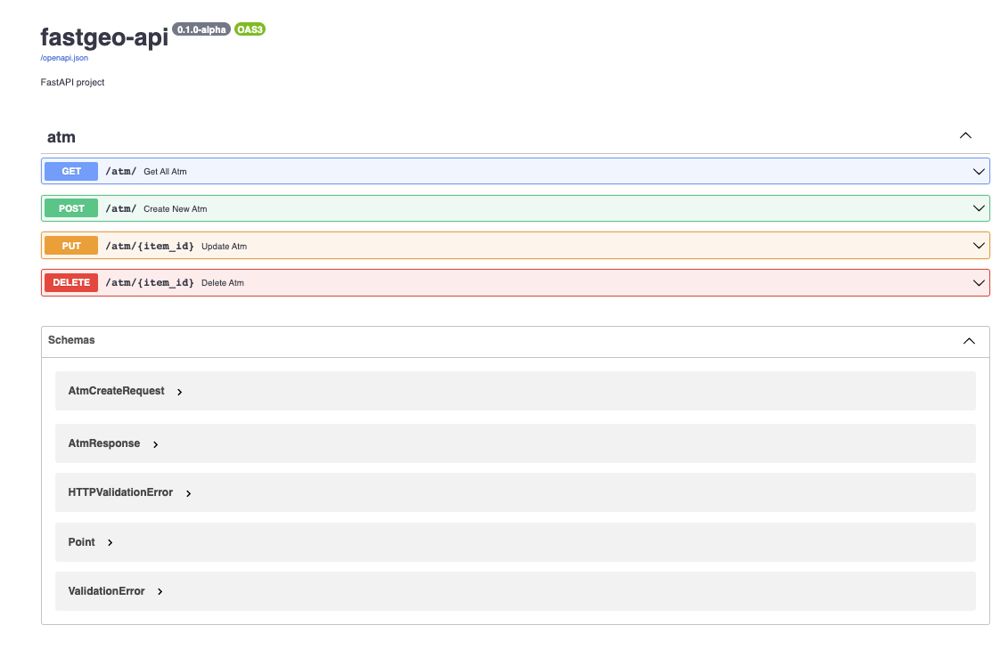

# FastGeo-API (Forked from @rafsaf)


- [async FastAPI + PostgreSQL](#minimal-async-fastapi--postgresql-template)
    - Referenced boilerplate from @tiangolo and @rafsaf
    - Forked: [minimal-fastapi-postgres-template](https://github.com/rafsaf/minimal-fastapi-postgres-template) 
    - Integrated w/ postgis extension


## Requirements

- [x] **SQLAlchemy 2.0 only**, async queries, best possible autocompletion support (SQLAlchemy 2.0.0 was released January 26, 2023)
- [x] Postgresql database under `asyncpg` w/ extension postgis
- [x] [Alembic](https://alembic.sqlalchemy.org/en/latest/) migrations
- [x] Two databases in docker-compose.yml (second one for tests) and ready to go Dockerfile with [Uvicorn](https://www.uvicorn.org/) webserver
- [x] [Poetry](https://python-poetry.org/docs/) (Optional) and Python 3.11 based
- [x] `pre-commit` with poetry export, autoflake, black, isort and flake8 (Optional)
- [x] Rich setup for pytest async tests with few included and extensible `conftest.py`

### 1. Install dependecies with poetry or without it (Please use python3.11)

```bash
cd project_name
### Poetry install (python3.11 other python version may not work!!)
poetry install

### Optionally there is also `requirements-dev.txt` file
python3.11 -m venv venv
source venv/bin/activate
pip install -r requirements-dev.txt
```

Note, be sure to use `python3.11` with this template with either poetry or standard venv & pip, if you need to stick to some earlier python version, you should adapt it yourself (remove new versions specific syntax for example `str | int` for python < 3.10 or `tomllib` for python < 3.11)

### 2. Setup databases (Modified docker-compose.yaml to use postgis docker image)

```bash
### Setup two databases
docker-compose up -d

### Alembic migrations upgrade and initial_data.py script
bash init.sh

### Check docker status
docker ps

### Go inside each docker container and add postgis extension
docker exec -ti practice-fastapi_default_database_1 psql -U postgres
# add extesnion
CREATE EXTENSION postgis;
# check if its added
SELECT PostGIS_full_version();

docker exec -ti practice-fastapi_test_database_1 psql -U postgres
# add extesnion
CREATE EXTENSION postgis;
# check if its added
SELECT PostGIS_full_version();

```

### 3. Now you can run app

```bash
### And this is it:
uvicorn app.main:app --reload

```

You should then use `git init` to initialize git repository and access OpenAPI spec at http://localhost:8000/ by default. To customize docs url, cors and allowed hosts settings, read section about it.

### 4. Running tests (Optional)

```bash
# Note, it will use second database declared in docker-compose.yml, not default one
pytest

# collected 1 item

# app/tests/test_atm.py::test_create_new_atm PASSED           [ 100%]
```                                                               
### 5. Activate pre-commit (Optional) 

[pre-commit](https://pre-commit.com/) is de facto standard now for pre push activities like isort or black.

Refer to `.pre-commit-config.yaml` file to see my opinionated choices.

```bash
# Install pre-commit
pre-commit install

# First initialization and run on all files
pre-commit run --all-files
```


### Data Model

```python
# app/model.py

class Atm(Base):
    __tablename__ = "atm"

    id: Mapped[int] = mapped_column(Integer, primary_key=True)
    geom: Mapped[str] = mapped_column(
        Geometry(geometry_type='POINT', srid=4326), nullable=True
    )
    address: Mapped[str] = mapped_column(String(100), nullable=False)
    provider: Mapped[str] = mapped_column(String(50), nullable=False)

    def __repr__(self):
        return "id:% s geom:% s address:% s provider:% s" % (self.id, self.geom, self.address, self.provider)
```
